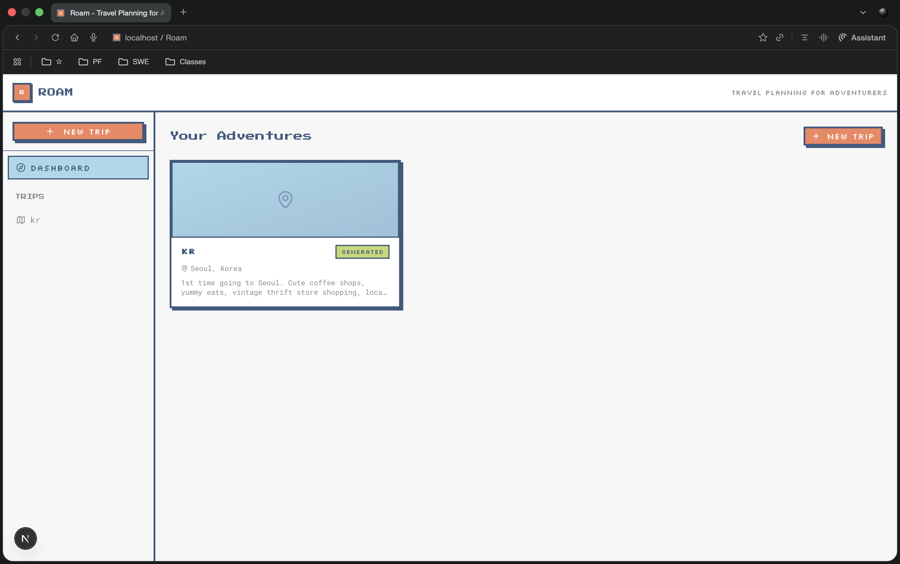

# Roam

An idea-curation, travel-planning web app.

[](docs/demo.mov)

[Watch full demo video (WIP)](docs/demo.mov)

## What it does

- Collect travel inspiration (links, TikToks, reels, articles, images)
- Generate AI trip plans from inspo (strict or creative)
- Edit itineraries in a block-style editor

## Stack

- Next.js + TypeScript
- Tailwind CSS + shadcn/ui
- Supabase (Postgres/Auth/Storage)
- OpenAI API

## Quick start

```bash
npm install
cp .env.example .env.local
npm run dev
```

Open `http://localhost:3000`.

## Environment

Required in `.env.local`:

- `NEXT_PUBLIC_SUPABASE_URL`
- `NEXT_PUBLIC_SUPABASE_ANON_KEY`
- `OPENAI_API_KEY`

## Flow (in progress)

`/dashboard` -> create trip -> add inspo -> generate itinerary -> accept and edit itinerary

## Next steps

1. Auth
2. Sharing
3. Group collab
4. Media upload
5. Maps
6. Export
7. Booking integrations

## Verify

- `npm run dev`
- `npm run build`
